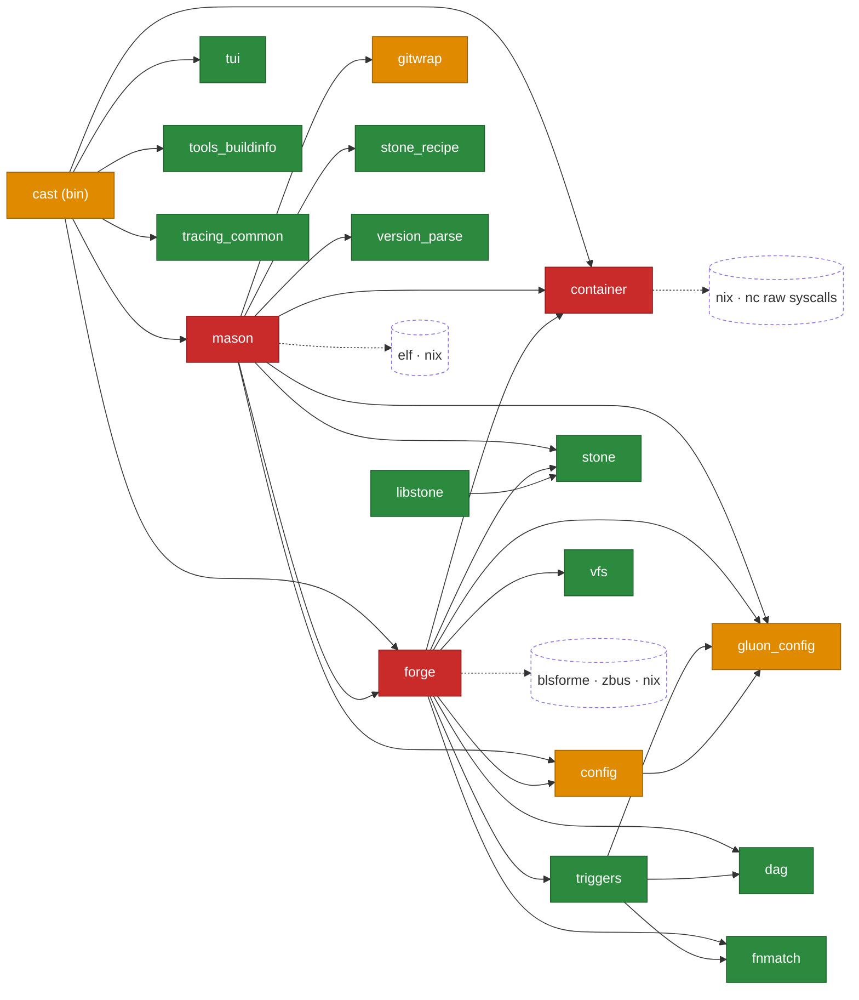
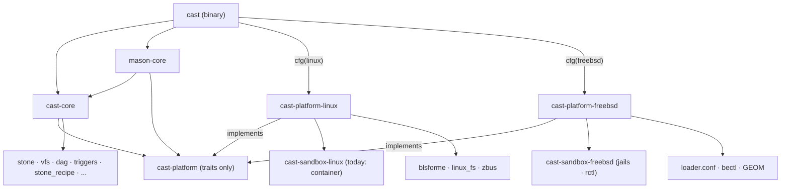

# Splitting Cast into `cast-core` + platform backends — Architecture Report

Based on a four-track audit of the workspace (the `container` crate, `forge`, `mason`/`bin/cast`/support
crates, and a repo-wide marker sweep), 2026-07-20. No code was changed as part of this analysis.

## 1. Executive summary

- **The workspace is unconditionally Linux by construction.** There is no `cfg(target_os = "linux")`
  gating anywhere (only 7 trivial `#[cfg(unix)]` test sites). Coupling is expressed directly through
  `nix` (~2,900 refs), `libc` (~3,500 refs), and raw syscall numbers, deliberately pinned to a
  documented **Linux 5.6 syscall baseline** (`crates/forge/src/linux_fs.rs`,
  `crates/mason/src/linux_fs.rs`).
- **Coupling is concentrated, not diffuse.** Three crates hold nearly all of it: `forge`
  (block/GPT/sysfs, boot, transaction primitives), `container` (namespaces, mounts, seccomp,
  cgroups), `mason` (build-sandbox glue). Twelve of eighteen crates are already neutral or one shim
  away.
- **Forge's transaction core is neutral in logic but Linux in expression** — install planning,
  resolution, journaling, and activation are portable ideas implemented directly in
  `openat2`/`renameat2`/procfs idioms rather than through any abstraction. ~70 files import
  `linux_fs`.
- **Two genuine architecture gaps for FreeBSD:** rootless builds (user namespaces have no jail
  analog) and the `RENAME_EXCHANGE`-centered atomic `/usr` activation (FreeBSD has no `renameat2`).
- **Service-manager coupling is nearly zero.** The only runtime D-Bus/systemd use is one logind
  `Inhibit` call in `crates/forge/src/signal.rs:36-62`. Everything else "systemd" is systemd-boot
  (BLS) data or deployment units.

## 2. Current dependency graph

Internal edges (from manifests), with coupling verdicts — **red** = deep Linux, **amber** =
shallow/extractable, **green** = neutral:

```
cast (bin) ──► forge, mason, container, tui, tools_buildinfo, tracing_common
mason      ──► forge, container, gitwrap, config, gluon_config, stone,
               stone_recipe, version_parse, tools_buildinfo, tui
forge      ──► container, config, dag, stone, triggers, tui, vfs,
               fnmatch, gluon_config
triggers   ──► dag, fnmatch, gluon_config
config     ──► gluon_config
libstone   ──► stone

External platform deps:  forge ──► blsforme, zbus, nix
                         container ──► nix, nc (raw syscalls)
                         mason ──► elf, nix
```

- **Red:** `forge` (7,769 pattern hits — linux_fs alone ~3,000), `container` (1,765), `mason` (1,418)
- **Amber:** `config`, `gluon_config` (raw `openat2`/`renameat2`/`__errno_location`), `gitwrap`
  (POSIX-mostly), `bin/cast` (broker mode)
- **Green:** `stone`, `stone_recipe`, `libstone`, `vfs`, `dag`, `triggers`, `fnmatch`, `astr`,
  `version_parse`, `tui`, `tracing_common`, `tools_buildinfo`



## 3. Subsystem inventory and classification

| # | Subsystem | Lives in | Verdict | Key Linux dependencies |
|---|---|---|---|---|
| 1 | Package format & archive I/O | `stone`, `libstone`, `stone_recipe`, `version_parse`, `astr` | **Neutral** | None; `stone_recipe`'s sandbox schema is Linux-*shaped* but code is pure |
| 2 | Dependency resolution & registry | `dag`, `vfs`, `forge::{registry,package,dependency}` | **Neutral** | None; architecture is a repo-index property, never host-detected (no `uname` anywhere) |
| 3 | CLI & UX | `bin/cast`, `tui`, `tracing_common` | **Neutral** | Thin dispatcher; one hidden Linux mode (`--private-device-broker`) |
| 4 | State & metadata DBs | `forge::db` | **Partial** | Diesel/SQLite neutral; connections anchored via `/proc/self/fd/<n>` paths (`db/meta/mod.rs:41` etc.) |
| 5 | Repository mgmt & fetch | `forge::repository` | **Partial** | Fetch is reqwest/tokio; storage uses `openat2` + proc-fd capability paths; `flock` portable |
| 6 | Configuration & triggers | `config`, `gluon_config`, `triggers`, `forge::system_model` | **Partial** | Gluon eval pure; file access on raw `openat2`/`RESOLVE_*`, `SYS_renameat2`, glibc-only `__errno_location` |
| 7 | Git/upstream materialization | `gitwrap`, parts of `mason::upstream` | **Partial** | Mostly POSIX (rlimits, setpgid, *at); one raw `renameat2` |
| 8 | Transaction core & activation | `forge::client` core, `tree_marker`, `transition_journal`, `installation` | **Tight** | Neutral logic, Linux expression: `openat2`, `RENAME_EXCHANGE` /usr hot-swap, `O_TMPFILE`+linkat, xattr ACL guards, authenticated procfs, `boot_id`, mount-ns identity |
| 9 | Block devices & mount topology | `forge::linux_fs` | **Tight (by charter)** | sysfs block parsing, `BLKSSZGET`/`BLKGETSIZE64` ioctls, mountinfo grammar, devtmpfs evidence, ns-file identity |
| 10 | Boot management | `forge::client/boot*` + `blsforme`, `misc/boot` | **Tight** | systemd-boot + BLS + UKI only (no GRUB); EFI vars, ESP/XBOOTLDR, `cast.fstx` cmdline, dracut initramfs early activation |
| 11 | Sandboxing & supervision | `container` | **Tight (deepest)** | clone3 + 8 namespace types, new mount API (`open_tree`/`move_mount`/`fsmount`/`mount_setattr`), pivot_root, seccomp-BPF (x86_64-hardcoded), cgroup v2, uid_map rootless model, pidfd, memfd seals, device broker |
| 12 | Build orchestration | `mason` | **Mixed** | Planner/recipe/ELF analysis largely neutral; executor needs PID-ns-init reaping, `execveat`, `sched_setaffinity`, `/proc/self/cgroup` discovery |
| 13 | Service/session integration | `forge::signal`, `misc/systemd` | **Partial** | One logind Inhibit call; broker relies on systemd socket activation + `CAP_MKNOD` |
| — | Deployment & test harness | `Makefile` (~100 suites), `misc/`, CI | **Tight** | `linux-*`-named suites, `systemd-run` fixtures, dracut module, Ubuntu-only CI |

## 4. Proposed crate structure

```
cast (binary)
 ├─► cast-core                  resolver, registry, package model, db, repo fetch,
 │      │                       transaction planning, journal logic, system-model
 │      └─► cast-platform       TRAITS ONLY + neutral types (no OS deps)
 ├─► mason-core ──► cast-core, cast-platform
 ├─[cfg(linux)]──► cast-platform-linux ──► cast-sandbox-linux (today: container),
 │                                          blsforme, linux_fs, zbus
 └─[cfg(freebsd)]► cast-platform-freebsd ─► cast-sandbox-freebsd (jails/rctl),
                                            loader.conf/bectl/GEOM
 (stone, vfs, dag, triggers, stone_recipe, … stay as-is under cast-core)
```



- `cast-core` never links a platform backend; the binary selects one via `cfg` and injects it.
- Keep **sandbox crates separate** from `cast-platform-*`: `container` is already a standalone unit
  with its own harness and two consumers, and FreeBSD sandboxing ships on a different schedule than
  FreeBSD fs primitives.
- The existing `Error::execution_capability_unavailable()` probe pattern
  (`crates/container/src/lib.rs:562`) is the natural front door for platform capability
  negotiation — consumers already degrade gracefully through it.

## 5. Trait boundaries

Contracts must be stated as **guarantees, not syscalls**, or Linux semantics leak into core and the
FreeBSD backend becomes an emulation layer.

### `PlatformFs` — kernel interaction / filesystem primitives

Guarantee: crash-durable, confinement-checked file publication relative to held directory
descriptors.

- Scoped open: resolve beneath an anchor, no symlinks, no device/magic-link escape
- Anonymous file → link-into-place publication; no-replace rename; **atomic pairwise exchange** of
  two directory entries
- Durable sync of file *and* parent directory; descriptor re-open capability (the current
  `/proc/self/fd` idiom)
- Metadata guards: xattr/ACL rejection, noatime open, secure random

Linux: `openat2 RESOLVE_*`, `O_TMPFILE`+`linkat`, `renameat2` `EXCHANGE`/`NOREPLACE`, fsync+dirsync,
`fsetxattr`, `/proc/self/fd`.
FreeBSD: `O_RESOLVE_BENEATH` (exists), tmpfile+linkat, fdescfs re-open, extattr — but *no
rename-exchange* → BE/symlink-swap strategy (see R2).

### `RuntimeEvidence` — process & boot-epoch authority

Guarantee: authenticated facts about "which boot, which mount view, which process state am I in."

- Boot epoch identifier; mount-namespace/view identity; single-thread audit; child fd-leak audit
- Supervised child handle: race-free signal + reap on a first-class handle

Linux: `/proc/sys/kernel/random/boot_id`, ns-file `st_dev/ino`, authenticated procfs walk, pidfd +
`waitid(P_PIDFD)`.
FreeBSD: `kern.boottime`/boot UUID sysctl, no mount namespaces (trait returns a constant identity),
`sysctl kern.proc`, `pdfork`/`pdkill` + kqueue `EVFILT_PROCDESC` (arguably a cleaner fit than pidfd).

### `DiskTopology` — block devices & mounts

Guarantee: identify the device and partition backing a mounted tree, and verify partition-table
identity.

- Enumerate block devices/partitions; GPT table identity (the parser itself is pure and stays in
  core)
- Device-number canonicalization; filesystem-type identity; bounded mount-table snapshot

Linux: `/sys/block` uevent/links, `BLKSSZGET`/`BLKGETSIZE64` ioctls, `/proc/*/mountinfo`, devtmpfs +
`f_type` magics.
FreeBSD: GEOM confxml sysctl / libgeom, `DIOCGSECTORSIZE`/`DIOCGMEDIASIZE`, `getfsstat`,
`f_fstypename` strings.

### `BootManager`

Guarantee: given installed kernel assets and a set of retained states, publish boot entries such
that each state is selectable and the newest is default.

- Discover kernels from the layout DB (already neutral); render entries; publish/sync to the boot
  partition; bounded rollback set; per-state kernel-argument injection (`cast.fstx=<id>`)

Linux: blsforme — BLS entries + UKIs on ESP/XBOOTLDR, systemd-boot assets, EFI vars, dracut
early-boot activation.
FreeBSD: loader.conf + loader menu entries, kernel env for state selection, **bectl/ZFS boot
environments** for rollback, rc.d early activation.

### `Sandbox` — isolated execution

Guarantee: run a payload in a confined root with declared binds, pseudo-filesystems, network
policy, and enforced resource ceilings; kill/drain reliably.

- Builder: root anchor, ro/rw binds, proc/tmp/sys/dev policy, hostname, networking, loopback
- Run payload; run in resource domain (limits: pids/memory/cpu); group kill + drain-until-empty
- Capability probe: "can this host sandbox at all, and rootlessly?" (the existing
  `execution_capability_unavailable` pattern becomes the trait's front door)

Linux: clone3 + namespaces, new mount API, pivot_root, seccomp, caps drop, cgroup v2 domains,
uid_map rootless model.
FreeBSD: `jail_set`/`jail_attach` (root-required), nullfs binds, per-jail devfs rulesets (which also
make the private-device broker unnecessary), VNET, rctl + cpuset, `jail_remove` as group-kill (a
*stronger* primitive than `cgroup.kill`), `procctl(PROC_NO_NEW_PRIVS_CTL)`.

### `SessionServices` — host service integration

Guarantee: optional, degradable host niceties; absence must never fail a transaction.

- Transaction inhibitor (block sleep/shutdown); privileged device provisioning; early-boot
  activation hook registration

Linux: logind Inhibit over D-Bus; socket-activated device broker (`CAP_MKNOD`); dracut module.
FreeBSD: no-op inhibitor (or rc shutdown hook); devfs rulesets; rc.d script.

## 6. High-risk areas

1. **R1 — Rootless sandboxing has no FreeBSD analog** *(architectural)*. The whole build model
   assumes unprivileged user namespaces (`idmap.rs`, `newgidmap`, `/etc/subgid`). Jails require
   root. Decision needed: root-only builds, setuid helper, or privileged daemon. The idmap layer
   gets deleted on FreeBSD, not ported.
2. **R2 — Atomic activation is built on `RENAME_EXCHANGE`** *(architectural, most safety-critical
   code in the tree)*. The `/usr` hot-swap, transition journal, and startup crash-recovery lean on
   atomic exchange + fsync ordering. FreeBSD's idiomatic substitute is ZFS boot environments —
   stronger, but it inverts the design (activation = BE promotion, not directory swap) and the
   journal's crash matrix must be re-derived.
3. **R3 — Security-posture parity is impossible 1:1.** Seccomp is a hand-built x86_64-only BPF
   filter; Capsicum is a different model entirely (fd capabilities, not syscall filtering). The
   Sandbox trait must state per-platform guarantees honestly.
4. **R4 — Boot stack is single-vendor.** blsforme fuses "compute what entries should exist"
   (portable) with "write them for systemd-boot" (Linux) — no seam today. The newer
   `active_reblit_*` renderer family partially creates one; put the trait boundary there. Dracut
   early activation (`misc/boot/cast-fstx.*`) must be redesigned for loader/rc.
5. **R5 — procfs-as-capability idiom hides in "neutral" code.** `/proc/self/fd` anchors SQLite,
   downloader targets, and O_PATH re-opens across db/repository/installation. Each site needs the
   `PlatformFs` re-open capability; fdescfs is not mounted by default on FreeBSD.
6. **R6 — Test substrate is Linux-shaped end to end.** ~100 make suites (many named `linux-*`),
   `systemd-run` fixtures, procfs-stat-parsing harness scripts, Ubuntu-only CI. Budget a FreeBSD CI
   substrate as its own workstream, done *first*.
7. **R7 — Long tail of sharp ABI details.** glibc-only `__errno_location` in `config`; raw
   `SYS_openat2`/`SYS_renameat2`/`SYS_getrandom` in three independent crates; `execveat` on O_PATH
   in mason (`fexecve` differs); `f_type` magic numbers throughout. Individually trivial,
   collectively weeks.

## 7. Effort estimates and sequencing

| Workstream | Size | Rough effort | Notes |
|---|---|---|---|
| P0 · cfg scaffolding, CI matrix stub, FreeBSD cross-check build | S | 1–2 wk | Makes coupling visible as compile errors |
| P1 · `cast-platform` traits + relocate linux_fs/boot/signal into `cast-platform-linux` | L | 6–10 wk | Mechanical but wide (~70 importer files); zero behavior change |
| P2 · Carve `cast-core` out of forge client (inline syscalls → trait calls) | L–XL | 8–12 wk | The R2 contract must be designed first |
| P3 · Shallow shims: config, gluon_config, gitwrap, cast bin | S | 1–2 wk | errno, openat2, renameat2 call sites |
| P4 · mason split (executor behind Sandbox trait) | M | 3–5 wk | Planner/analysis untouched |
| F1 · FreeBSD fs primitives + disk topology + evidence | L–XL | 2–4 mo | Hinges on the ZFS-first decision (R2) |
| F2 · FreeBSD sandbox backend (jails/nullfs/devfs/rctl) | XL | 3–6 mo | Includes the R1 privilege-model decision and security-posture doc (R3) |
| F3 · FreeBSD boot backend (loader.conf, bectl, rc) | L | 4–8 wk | Simpler than Linux if BEs carry rollback |
| F4 · FreeBSD test/CI substrate | M–L | 4–8 wk | Do early — before F1, not after |

**Sequencing:** P0 → P1 → (P3 ∥ P4) → P2, keeping Linux behavior byte-identical throughout
(existing suites stay green — P1 is a pure relocation). On the FreeBSD side: F4 first, then a
**read-only milestone** (query/resolve/fetch/install-into-image-root with sandbox and boot stubbed
via capability probes) before F1/F2, F3 last.

Totals: **~4–6 engineer-months** for the split, **~8–12 more** to a first functional FreeBSD
backend — with R1 and R2 decided up front, since both change trait contracts, not just
implementations.
